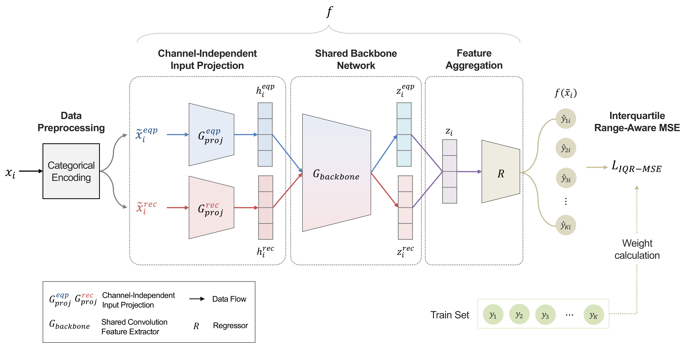

# RACI

This is the official code of paper **Range-Aware Multi-Output Regression with Channel-Independent Feature Extraction for Electrical Test Prediction** based on PyTorch



## Installation
```bash
# pip
pip install -r requirements.txt

# conda
conda install --file requirements.txt
```

## Training and Inference
Run the following in your terminal:
```bash
python main.py \
    --checkpoint-root "./Results/" \
    --lr 5e-3 \
    --lr-scheduler cosine \
    --backbone CNN \
    --kernel-size 2 \
    --seed 0 \
    --agg avg \
    --encoding-type Count \
    --batch-size 32 \
    --epochs 1000 \
    --patience 500 \
    --num-workers 4
```
We highly recommend that [`Weights & Biases`](https://kr.wandb.ai/) to monitor model training. Make sure to log into `Wandb` in the console and then simply add the argument `--enable-wandb` to save additional plots and logging information.

## Contact
If you have any problem about our code, feel free to contact 
* jihyun_k@korea.ac.kr
